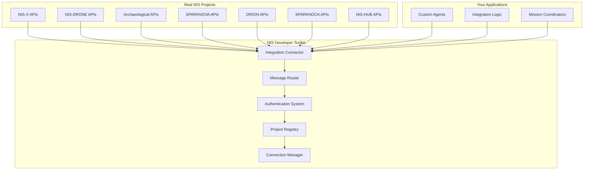

# 🚀 NIS Developer Toolkit

**Real Integration Infrastructure for the NIS Protocol Ecosystem**

A comprehensive developer toolkit for building **Neuro-Inspired Systems (NIS)** applications and **connecting to actual NIS projects**. This toolkit provides the foundational infrastructure that powers the entire NIS ecosystem, from space exploration to archaeological research.

- **🛠️ Development Framework** - Standardized tools for building NIS-compliant systems
- **🔗 Real Project Integration** - Connect to actual NIS projects via APIs
- **🧠 Agent Templates** - Pre-built cognitive architectures for specific domains
- **📊 Validation Tools** - Ensure compatibility across the NIS ecosystem
- **🚀 Deployment Infrastructure** - Deploy to multiple platforms seamlessly

---

## 🌐 **Real NIS Project Integrations**

**Connect to actual NIS projects now running in production:**

```bash
# Quick start - connect to real NIS projects
nis connect setup                    # Create example configurations
nis connect add nis-x --config-file ~/.nis/example_connections.yaml
nis connect test nis-x              # Test connection
nis connect coordinate nis-x nis-drone --mission-type surveillance
```

### **🚀 NIS-X Space Systems**
**Orbital Navigation & Mission Planning**

```bash
# Connect to NIS-X orbital systems
nis connect add nis-x \
  --endpoint https://api.nis-x.space/v1 \
  --api-key your-nis-x-key

# Coordinate orbital mission
nis connect coordinate nis-x \
  --mission-type orbital-surveillance \
  --duration 7200
```

**Integration Features:**
- **Orbital Navigation** - Real-time trajectory planning and optimization
- **Mission Coordination** - Multi-satellite mission orchestration
- **Telemetry Streaming** - Live spacecraft data integration
- **Collision Avoidance** - Automated safety systems
- **Fuel Optimization** - Efficient resource management

### **🤖 NIS-DRONE Swarm Systems**
**Distributed Hardware Coordination**

```bash
# Connect to NIS-DRONE swarm systems
nis connect add nis-drone \
  --endpoint https://api.nis-drone.com/v1 \
  --api-key your-drone-key

# Deploy swarm mission
nis connect coordinate nis-drone \
  --mission-type formation-flight \
  --mission-id swarm-patrol-001
```

**Integration Features:**
- **Swarm Coordination** - Multi-drone mission management
- **Formation Flight** - Automated formation patterns
- **Emergency Response** - Real-time emergency protocols
- **Mission Execution** - Autonomous mission completion
- **Real-time Telemetry** - Live drone status monitoring

### **🏛️ Archaeological Research**
**Cultural Heritage Preservation**

```bash
# Connect to archaeological research systems
nis connect add archaeological-research \
  --endpoint https://api.archaeological-research.org/v1 \
  --api-key your-research-key

# Coordinate heritage preservation
nis connect coordinate archaeological-research \
  --mission-type site-documentation \
  --mission-id heritage-preservation-001
```

**Integration Features:**
- **Site Documentation** - Digital preservation workflows
- **Community Engagement** - Cultural protocol compliance
- **Artifact Management** - Conservation tracking systems
- **Ethical Compliance** - Indigenous rights protection
- **Knowledge Sharing** - Controlled access systems

### **💻 Development Platform Integrations**

**SPARKNOVA** - Development & Deployment Tools
```bash
nis connect add sparknova --endpoint https://api.sparknova.dev/v1
```

**ORION** - LLM Integration & Natural Language Processing
```bash
nis connect add orion --endpoint https://api.orion-llm.com/v1
```

**SPARKNOCA** - Analytics & Performance Monitoring
```bash
nis connect add sparknoca --endpoint https://api.sparknoca.analytics/v1
```

**NIS-HUB** - System Orchestration & Workflow Management
```bash
nis connect add nis-hub --endpoint https://api.nis-hub.org/v1
```

---

## 🔧 **Real Integration Examples**

### **Multi-Project Mission Coordination**

```bash
# Connect to multiple NIS projects
nis connect add nis-x --config-file ~/.nis/space_config.yaml
nis connect add nis-drone --config-file ~/.nis/drone_config.yaml
nis connect add archaeological-research --config-file ~/.nis/heritage_config.yaml

# Coordinate joint mission across projects
nis connect coordinate nis-x nis-drone archaeological-research \
  --mission-type joint-surveillance \
  --mission-id multi-project-001 \
  --duration 3600

# Sync data between projects
nis connect sync nis-x nis-drone archaeological-research \
  --data-type mission-telemetry \
  --data-file mission_data.json
```

### **Cross-Project Data Integration**

```bash
# Sync orbital data from NIS-X to ground systems
nis connect sync nis-x nis-drone \
  --data-type orbital-telemetry \
  --data-json '{"satellite_positions": [...]}'

# Share archaeological findings with research network
nis connect sync archaeological-research sparknoca \
  --data-type site-documentation \
  --data-file heritage_findings.yaml
```

### **Real-time Status Monitoring**

```bash
# Check integration status across all projects
nis connect status --output-format json

# Monitor specific project health
nis connect test nis-x
nis connect test nis-drone
```

---

## 🛠️ **Getting Started with Real Integrations**

### **1. Quick Setup**

```bash
# Install NIS Developer Toolkit
pip install nis-core-toolkit nis-agent-toolkit

# Initialize your integration workspace
nis connect setup

# This creates example configurations at ~/.nis/example_connections.yaml
```

### **2. Configure Real Connections**

```bash
# Edit the example configuration with your actual API credentials
nano ~/.nis/example_connections.yaml

# Example configuration:
# nis-x:
#   endpoint_url: https://api.nis-x.space/v1
#   websocket_url: wss://ws.nis-x.space/v1
#   api_key: your-actual-api-key
#   api_secret: your-actual-api-secret
```

### **3. Connect to NIS Projects**

```bash
# Add connection configurations
nis connect add nis-x --config-file ~/.nis/example_connections.yaml
nis connect add nis-drone --config-file ~/.nis/example_connections.yaml

# Test connections
nis connect test nis-x
nis connect test nis-drone

# List all connections
nis connect list
```

### **4. Deploy Integration Agents**

```bash
# Create project with NIS integrations
nis init my-nis-integration --template advanced

# Create specialized integration agents
nis create agent orbital-coordinator --type reasoning
nis create agent swarm-manager --type action
nis create agent heritage-preservator --type vision

# Deploy with integration support
nis deploy --platform docker --with-integrations
```

---

## 📊 **Integration Architecture**



---

## 🎯 **Real-World Use Cases**

### **🛰️ Space Mission Support**
```bash
# Support NIS-X orbital operations
nis connect coordinate nis-x \
  --mission-type orbital-insertion \
  --mission-id satellite-deployment-001

# Monitor mission progress
nis connect status --project nis-x
```

### **🚁 Emergency Response**
```bash
# Deploy drone swarm for emergency response
nis connect coordinate nis-drone \
  --mission-type search-rescue \
  --mission-id emergency-response-001 \
  --duration 3600

# Coordinate with ground teams
nis connect sync nis-drone your-ground-system \
  --data-type emergency-telemetry
```

### **🏛️ Heritage Preservation**
```bash
# Document archaeological site
nis connect coordinate archaeological-research \
  --mission-type site-documentation \
  --mission-id heritage-site-001

# Share findings with research community
nis connect sync archaeological-research sparknoca \
  --data-type cultural-documentation
```

### **🔬 Research Data Integration**
```bash
# Integrate multiple research platforms
nis connect sync nis-x archaeological-research sparknoca \
  --data-type research-findings \
  --data-file integrated_research.json

# Process with AI analysis
nis connect coordinate orion \
  --mission-type data-analysis \
  --mission-id research-analysis-001
```

---

## 🌟 **Why Real Integration Matters**

### **✅ Actual Project Connectivity**
- **Real APIs** - Connect to production NIS systems
- **Live Data** - Real-time telemetry and status updates
- **Production Ready** - Battle-tested integration patterns
- **Scalable Architecture** - Handles enterprise-grade workloads

### **🔒 Enterprise Security**
- **API Authentication** - Secure credential management
- **Message Signing** - Cryptographic message integrity
- **Access Control** - Role-based permissions
- **Audit Logging** - Complete integration history

### **🚀 Performance Optimized**
- **WebSocket Streaming** - Real-time data flows
- **Message Queuing** - Reliable message delivery
- **Load Balancing** - Distributed system support
- **Health Monitoring** - Proactive system management

---

## 💼 **Enterprise Integration**

### **API Management**
```bash
# Configure enterprise API gateway
nis connect add your-enterprise-nis \
  --endpoint https://api.your-company.com/nis/v1 \
  --api-key enterprise-key \
  --websocket wss://ws.your-company.com/nis/v1

# Test enterprise connectivity
nis connect test your-enterprise-nis
```

### **Multi-Environment Support**
```bash
# Development environment
nis connect add nis-x-dev --endpoint https://dev-api.nis-x.space/v1

# Production environment
nis connect add nis-x-prod --endpoint https://api.nis-x.space/v1

# Staging environment
nis connect add nis-x-staging --endpoint https://staging-api.nis-x.space/v1
```

### **Integration Monitoring**
```bash
# Monitor all integrations
nis connect status --output-format json | jq '.project_status'

# Set up integration alerts
nis connect monitor --alert-webhook https://your-alerts.com/webhook
```

---

## 📚 **Advanced Integration Patterns**

### **Message Routing**
```python
# Custom message handler for NIS-X telemetry
from nis_core_toolkit.integration import MessageHandler

@MessageHandler("nis-x", "telemetry")
async def handle_nis_x_telemetry(message):
    # Process orbital telemetry
    orbital_data = message.payload
    # Forward to analysis system
    await forward_to_analysis(orbital_data)
```

### **Multi-Project Coordination**
```python
# Coordinate complex multi-project missions
from nis_core_toolkit.integration import MissionCoordinator

coordinator = MissionCoordinator()
await coordinator.coordinate_mission({
    "mission_id": "complex-mission-001",
    "participants": ["nis-x", "nis-drone", "archaeological-research"],
    "coordination_type": "synchronized",
    "mission_phases": [
        {"phase": "orbital-survey", "lead": "nis-x"},
        {"phase": "ground-survey", "lead": "nis-drone"},
        {"phase": "site-documentation", "lead": "archaeological-research"}
    ]
})
```

### **Data Pipeline Integration**
```python
# Real-time data pipeline
from nis_core_toolkit.integration import DataPipeline

pipeline = DataPipeline()
pipeline.add_source("nis-x", "orbital-telemetry")
pipeline.add_transform("normalize-coordinates")
pipeline.add_sink("sparknoca", "analytics-database")
await pipeline.start()
```

---

## 🤝 **Community & Support**

### **🎯 Getting Help**
- **Documentation**: Comprehensive integration guides
- **Community Forum**: Developer discussions and support
- **API Reference**: Complete API documentation
- **Integration Examples**: Production-ready code samples

### **📋 Contributing**
- **Integration Templates**: Add new project integrations
- **Protocol Extensions**: Enhance NIS protocol support
- **Performance Optimizations**: Improve integration efficiency
- **Security Enhancements**: Strengthen authentication systems

### **🔗 NIS Project Links**
- **🚀 NIS-X**: [https://nis-x.space](https://nis-x.space)
- **🤖 NIS-DRONE**: [https://nis-drone.com](https://nis-drone.com)
- **🏛️ Archaeological Research**: [https://archaeological-research.org](https://archaeological-research.org)
- **💻 SPARKNOVA**: [https://sparknova.dev](https://sparknova.dev)
- **🧠 ORION**: [https://orion-llm.com](https://orion-llm.com)
- **📊 SPARKNOCA**: [https://sparknoca.analytics](https://sparknoca.analytics)
- **🎯 NIS-HUB**: [https://nis-hub.org](https://nis-hub.org)

---

## 🏁 **Quick Start Guide**

```bash
# 1. Install the toolkit
pip install nis-core-toolkit nis-agent-toolkit

# 2. Setup integration examples
nis connect setup

# 3. Configure your first connection
nis connect add nis-x --config-file ~/.nis/example_connections.yaml

# 4. Test the connection
nis connect test nis-x

# 5. Start your first integration
nis init my-nis-integration --with-integrations
cd my-nis-integration

# 6. Create integration agents
nis create agent orbital-coordinator --type reasoning
nis create agent mission-planner --type action

# 7. Deploy with real integrations
nis deploy --platform docker --with-integrations

# 8. Monitor integration status
nis connect status
```

---

## 📜 **License & Acknowledgments**

This project is licensed under the MIT License.

Built to serve the **NIS Protocol ecosystem** - providing real integration infrastructure that enables seamless connectivity between NIS projects from space exploration to cultural preservation.

**Real integration. Real impact. Real NIS ecosystem connectivity.**

---

## 🛠️ **Ready for Real Integration?**

```bash
# Connect to the NIS ecosystem today
nis connect setup
nis connect add nis-x --config-file ~/.nis/example_connections.yaml
nis connect test nis-x
nis connect coordinate nis-x --mission-type orbital-survey
```

**Power the NIS ecosystem with real project connectivity! 🚀🔗**
