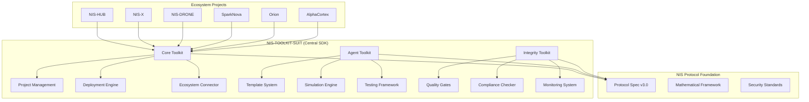

# 🚀 NIS-TOOLKIT-SUIT

**The Official SDK for Organica AI's NIS Protocol Ecosystem**

[](https://github.com/organica-ai/NIS-TOOLKIT-SUIT)
[](https://github.com/organica-ai/NIS_Protocol)
[](LICENSE)
[](https://python.org)

The unified development toolkit that powers the entire **Organica AI ecosystem** - from space exploration to archaeological research. This is the **required foundation** for building any NIS Protocol-compatible system.

---

## 🧠 **Dual-Track Architecture**

**NIS-TOOLKIT-SUIT uniquely serves both human developers AND AI agents with purpose-built tools:**

```
📦 NIS-TOOLKIT-SUIT = DevTools + AgentMind

├─ 🔧 NIS Developer Toolkit (NDT)
│   └─ For human engineers building multi-agent systems
│
└─ 🤖 NIS Agent Toolkit (NAT)
    └─ For AI agents to reason, perceive, and act modularly
```

### **🔧 Track 1: For Human Developers → NIS Developer Toolkit (NDT)**
*"Build intelligent systems — modular, verifiable, and protocol-compliant."*

**Purpose:** System design, orchestration, and operations  
**Audience:** Researchers, engineers, institutions  
**Scope:** Full cognitive pipelines and multi-agent systems  

**Core Capabilities:**
- 🏗️ **Project Scaffolding** - CLI tools to initialize NIS-compliant projects
- ⚡ **Protocol Validation** - MCP/ACP/SEED compliance checking
- 🚀 **System Deployment** - Multi-platform orchestration and scaling
- 🔗 **Ecosystem Integration** - Connect to all NIS projects seamlessly
- 🛡️ **Integrity Assurance** - Quality gates and engineering standards

### **🤖 Track 2: For AI Agents → NIS Agent Toolkit (NAT)**
*"Think, reason, observe, and act — with memory, tools, and traceability."*

**Purpose:** Agent cognition, memory, and modular intelligence  
**Audience:** AI agents themselves (and their developers)  
**Scope:** Individual agent minds and cognitive architectures  

**Core Capabilities:**
- 🧠 **BaseNISAgent Interface** - observe → decide → act cognitive loop
- 🎭 **Agent Templates** - Reasoning, Vision, Memory, Emotion, Action agents
- 🔧 **Tool Integration** - CoT, LangChain, calculators, search, APIs
- 🎮 **Simulation Environments** - Safe testing and self-evaluation
- 📊 **Cognitive Traceability** - Full reasoning chain visibility

---

## 🔁 **Why This Dual-Track Approach Matters**

| Track | Audience | Purpose | Scope | Output |
|-------|----------|---------|-------|--------|
| **NDT** | Human Devs | System design, orchestration, ops | Full pipelines | Multi-agent systems |
| **NAT** | AI Agents | Agent cognition, memory, tool use | Modular minds | Intelligent agents |

**Strategic Benefits:**
- ✅ **Clean Separation of Concerns** - System architecture vs cognitive architecture
- ✅ **Mirrors Natural Intelligence** - Organisms (systems) vs brains (agents)
- ✅ **Future-Proof Design** - Framework AND platform for AGI development
- ✅ **Unified Protocol** - Both tracks speak the same NIS Protocol language

---

## 🌐 **Ecosystem Position**

**NIS-TOOLKIT-SUIT** sits at the heart of Organica AI's multi-domain AGI ecosystem:

```
Organica-Ai-Solutions/
├── NIS_Protocol            # The formal spec + math (MCP, ACP, SEED)
├── NIS-TOOLKIT-SUIT        # 🎯 Central SDK (YOU ARE HERE)
│   ├── nis-core-toolkit    # CLI + Project Management
│   ├── nis-agent-toolkit   # Agent Builder + Templates  
│   └── nis-integrity-kit   # Quality Assurance
├── NIS-HUB                 # Central AGI routing system
├── NIS-X                   # Scientific system for exoplanets
├── NIS-DRONE               # Autonomous robotics project
├── SparkNova               # Developer IDE + agent store
├── Orion                   # Frontend/assistant shell
├── AlphaCortex             # Trading system
└── ArchaeologicalResearch  # Legacy discovery AI
```

**Every NIS-powered system depends on this toolkit** - it's the bridge between the NIS Protocol specification and real-world implementations.

---

## ⚡ **One-Command Installation**

```bash
# Install the complete SDK
curl -sSL https://raw.githubusercontent.com/organica-ai/NIS-TOOLKIT-SUIT/main/install.sh | bash

# Or clone and install locally
git clone https://github.com/organica-ai/NIS-TOOLKIT-SUIT.git
cd NIS-TOOLKIT-SUIT
./install.sh
```

**What gets installed:**
- 🔧 **NIS Core Toolkit** - Project management, validation, deployment
- 🤖 **NIS Agent Toolkit** - Agent creation, simulation, templates
- 🛡️ **NIS Integrity Toolkit** - Quality assurance, compliance checking
- 📊 **Unified CLI** - Single command interface for all operations
- 🔗 **Ecosystem Integration** - Direct connectivity to all NIS projects

---

## 🎯 **Why This Toolkit Exists**

### **Problem:** 
Building AGI systems across multiple domains (space, robotics, research) without a unified development foundation leads to fragmentation, incompatibility, and duplicated effort.

### **Solution:**
**NIS-TOOLKIT-SUIT** provides the standardized SDK that ensures:
- ✅ **Universal Compatibility** - All NIS systems use the same foundation
- ✅ **Protocol Compliance** - Automatic validation against NIS Protocol standards
- ✅ **Rapid Development** - Pre-built templates and scaffolding
- ✅ **Quality Assurance** - Built-in integrity checking and validation
- ✅ **Ecosystem Integration** - Direct connection to all Organica AI projects

---

## 🔧 **Core Components**

### **📦 NIS Core Toolkit (`nis-core-toolkit`)**
*Project management and system orchestration*

```bash
nis init my-agi-system              # Initialize new NIS project
nis create agent orbital-nav --type reasoning
nis validate                        # Validate protocol compliance  
nis deploy --platform docker       # Deploy to any platform
nis connect nis-x                   # Connect to ecosystem projects
```

**Features:**
- Project scaffolding with NIS Protocol compliance
- Multi-platform deployment (local, Docker, cloud)
- Real-time ecosystem connectivity 
- Validation and quality gates
- Configuration management

### **🤖 NIS Agent Toolkit (`nis-agent-toolkit`)**
*Intelligent agent creation and management*

```bash
nis-agent create consciousness-engine --type reasoning
nis-agent simulate --scenario orbital-nav
nis-agent test --coverage 95
```

**Agent Types:**
- **Reasoning Agents** - Chain-of-thought, mathematical reasoning
- **Vision Agents** - Visual processing and analysis
- **Memory Agents** - Long-term knowledge management
- **Action Agents** - Tool use and environment interaction

### **🛡️ NIS Integrity Toolkit (`nis-integrity-toolkit`)**
*Quality assurance and engineering integrity*

```bash
nis-integrity audit                 # Comprehensive system audit
nis-integrity monitor --real-time   # Continuous quality monitoring
```

**Integrity Features:**
- Prevents AI hype and ensures technical accuracy
- Validates performance claims with evidence
- Enforces honest documentation standards
- Monitors long-term system reliability

---

## 🚀 **Quick Start: Dual-Track Development**

### **🔧 Track 1: Human Developers (NDT) - Build Systems**

```bash
# 1. Install the complete toolkit
curl -sSL https://raw.githubusercontent.com/organica-ai/NIS-TOOLKIT-SUIT/main/install.sh | bash

# 2. Create your multi-agent system
nis init NIS-Weather --template advanced
cd NIS-Weather

# 3. Build intelligent agents
nis create agent climate-analyzer --type reasoning
nis create agent sat-vision --type vision
nis create agent data-collector --type action

# 4. Validate system compliance
nis validate && nis-integrity audit

# 5. Deploy and connect to ecosystem
nis deploy --platform docker --with-integrations
nis connect add nis-x --endpoint https://api.nis-x.space
```

**You've just built a complete NIS-compliant multi-agent system! 🎉**

---

### **🤖 Track 2: AI Agents (NAT) - Build Minds**

```bash
# 1. Initialize agent development environment  
nis-agent init cognitive-agent --template reasoning

# 2. Implement cognitive functions
nis-agent scaffold observe decide act --with-memory

# 3. Add tool integration
nis-agent tools add calculator web-search langchain

# 4. Test in simulation
nis-agent simulate --scenario complex-reasoning --iterations 100

# 5. Deploy as autonomous agent
nis-agent deploy --mode autonomous --safety-checks enabled
```

**You've just created a sophisticated reasoning agent! 🧠**

---

### **🔁 Dual-Track Integration**

```bash
# Combine both tracks: Deploy agent into system
nis system add-agent ./cognitive-agent --integration-mode full

# Multi-agent coordination
nis coordinate --agents climate-analyzer sat-vision cognitive-agent
```

**Perfect integration of system architecture and agent cognition! ⚡**

---

## 🌟 **Ecosystem Integration**

### **🔗 Required Dependency**
**Every NIS project requires this toolkit:**

```yaml
# package.json, setup.py, or requirements.txt
dependencies:
  - nis-toolkit-suit: "^1.0.0"
```

### **🚀 Supported Projects**
Projects built with or requiring NIS-TOOLKIT-SUIT:

| Project | Type | Status | Integration |
|---------|------|--------|-------------|
| **[NIS-HUB](https://github.com/organica-ai/NIS-HUB)** | Central Routing | Production | ✅ Full |
| **[NIS-X](https://github.com/organica-ai/NIS-X)** | Space Systems | Production | ✅ Full |
| **[NIS-DRONE](https://github.com/organica-ai/NIS-DRONE)** | Robotics | Production | ✅ Full |
| **[SparkNova](https://github.com/organica-ai/SparkNova)** | Developer IDE | Beta | ✅ Full |
| **[Orion](https://github.com/organica-ai/Orion)** | Frontend Shell | Beta | ✅ Full |
| **[AlphaCortex](https://github.com/organica-ai/AlphaCortex)** | Trading System | Alpha | 🔄 Integrating |
| **[ArchaeologicalResearch](https://github.com/organica-ai/ArchaeologicalResearch)** | Research AI | Legacy | 🔄 Migrating |

### **📋 Protocol Compatibility Matrix**

| NIS Protocol Version | Toolkit Version | Features | Status |
|---------------------|----------------|----------|--------|
| **v3.0** (Current) | 1.0.x | KAN, Consciousness Interface, Basic AGI | ✅ Stable |
| **v4.0** (Q2 2025) | 1.5.x | Enhanced Mathematical Frameworks | 🔄 In Development |
| **v5.0** (Q4 2025) | 2.0.x | Advanced Space/AGI Applications | 📋 Planned |
| **v6.0+** (2026+) | 3.0.x+ | Full Multi-Domain AGI | 📋 Roadmap |

---

## 💼 **For Project Maintainers**

### **🏷️ Add NIS Compatibility Badge**
Show that your project is built with the official toolkit:

```markdown
[](https://github.com/organica-ai/NIS-TOOLKIT-SUIT)
```

### **📝 Integration Checklist**
To make your project NIS-compatible:

- [ ] Add `nis-toolkit-suit` dependency
- [ ] Initialize with `nis init`
- [ ] Use `nis validate` in CI/CD
- [ ] Include integrity checks
- [ ] Connect to ecosystem APIs
- [ ] Document protocol compliance

### **🔧 Development Dependencies**
```yaml
# For NIS ecosystem projects
development_dependencies:
  - nis-toolkit-suit[dev]: "^1.0.0"
  - nis-integrity-toolkit: "^1.0.0"

scripts:
  validate: "nis validate"
  integrity: "nis-integrity audit"
  deploy: "nis deploy"
```

---

## 🏗️ **Architecture**



---

## 📚 **Documentation**

### **🎯 Getting Started**
- [Installation Guide](docs/installation.md)
- [Quick Start Tutorial](docs/quickstart.md)
- [Protocol Compliance](docs/compliance.md)
- **[🧠 Dual-Track Architecture](docs/dual_track_architecture.md)** - Core design philosophy

### **🔧 Development**
- [Core Toolkit API](nis-core-toolkit/README.md)
- [Agent Toolkit Guide](nis-agent-toolkit/README.md)
- [Integrity Standards](nis-integrity-toolkit/README.md)

### **🌐 Ecosystem**
- [Protocol Compatibility Matrix](docs/compatibility_matrix.md)
- [Integration Guidelines](docs/integration.md)
- [Deployment Strategies](docs/deployment.md)

### **💡 Examples**
- [Complete NIS Project](examples/nis_v3_complete_integration.py)
- [Multi-Agent Coordination](examples/multi_agent_demo.py)
- [Ecosystem Integration](examples/ecosystem_integration.py)

---

## 🤝 **Contributing**

### **🎯 Contribution Areas**
1. **Core Toolkit** - Project management features
2. **Agent Templates** - New agent types and capabilities
3. **Ecosystem Integrations** - New project connections
4. **Documentation** - Guides and examples
5. **Quality Assurance** - Testing and validation

### **📋 Development Setup**
```bash
git clone https://github.com/organica-ai/NIS-TOOLKIT-SUIT.git
cd NIS-TOOLKIT-SUIT
./install.sh
# Select option 5: Development Installation
```

### **🔄 Pull Request Process**
1. Fork the repository
2. Create feature branch: `git checkout -b feature/amazing-feature`
3. Run integrity checks: `nis-integrity audit`
4. Validate changes: `nis validate`
5. Submit pull request with clear description

---

## 📜 **License & Acknowledgments**

**License:** MIT License - see [LICENSE](LICENSE) file for details.

**Built by:** [Organica AI](https://organica-ai.com) - The future of multi-domain AGI.

**Foundation:** Based on the [NIS Protocol](https://github.com/organica-ai/NIS_Protocol) specification.

---

## 🌟 **Join the Ecosystem**

**Ready to build the future of AGI?**

```bash
# Install the SDK
curl -sSL https://raw.githubusercontent.com/organica-ai/NIS-TOOLKIT-SUIT/main/install.sh | bash

# Create your first NIS system
nis init my-agi-system
cd my-agi-system
nis create agent my-agent --type reasoning
nis validate && nis deploy

# Connect to the ecosystem
nis connect add nis-hub
```

---

**🚀 Build AGI systems that work across space, Earth, and everything in between.**  
**🌐 Join the NIS Protocol ecosystem today.**

[](docs/quickstart.md)
[](https://discord.gg/organica-ai)
[](docs/)
